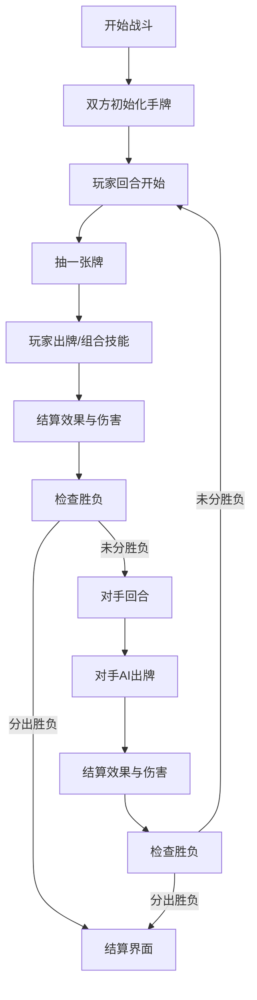

# 元素卡牌对战游戏 - 产品需求文档

## 1. 产品概述

一款以火、水、土、风四元素为核心的策略卡牌对战游戏，玩家通过将元素卡牌两两搭配释放强力组合技能，在精美的奇幻场景中与对手展开智慧对决。游戏参考炉石传说的视觉风格，主打策略深度与视觉享受的双重体验。

- **核心玩法**：元素组合机制，四元素两两搭配触发6种独特技能效果
- **目标用户**：卡牌游戏爱好者、策略游戏玩家
- **产品价值**：创新的组合机制带来丰富策略深度，精美视觉呈现提升游戏体验

## 2. 核心功能

### 2.1 游戏模式

| 模式名称 | 玩法描述 | 目标 |
|---------|---------|------|
| 经典对战 | 玩家与AI各持卡组，轮流出牌对战，将对手生命值降为0获胜 | 策略对决 |
| 挑战模式 | 多关卡Boss挑战，每个Boss有独特技能和机制 | 闯关进阶 |
| 无尽模式 | 无限波次敌人，考验卡组续航能力 | 极限挑战 |
| 快速对战 | 简化规则，3分钟一局，适合碎片化时间 | 休闲娱乐 |

### 2.2 功能模块

1. **主菜单界面**：游戏标题、模式选择、设置入口
2. **战斗界面**：战场区域、手牌区、生命值、法力值、回合控制
3. **卡牌系统**：单元素卡牌、组合技能、卡牌收集
4. **战斗系统**：回合制、伤害计算、效果触发、胜负判定
5. **特效系统**：卡牌动画、技能特效、场景动效

### 2.3 页面详情

| 页面名称 | 模块名称 | 功能描述 |
|---------|---------|---------|
| 主菜单 | 标题区域 | 游戏Logo、装饰性元素、动态背景 |
| 主菜单 | 模式选择 | 四种游戏模式卡片，悬停动效 |
| 主菜单 | 设置按钮 | 音效、音乐、画质设置 |
| 战斗界面 | 战场区域 | 双方英雄、场地装饰、已打出的卡牌 |
| 战斗界面 | 手牌区 | 玩家手牌、拖拽出牌、卡牌详情悬浮 |
| 战斗界面 | 信息栏 | 生命值、法力值、回合数、结束回合按钮 |
| 战斗界面 | 效果展示 | 技能特效动画、伤害数字、状态图标 |
| 结算界面 | 胜负展示 | 胜利/失败动画、奖励展示、再来一局 |

## 3. 核心流程

### 3.1 游戏流程

玩家从主菜单选择游戏模式 → 进入战斗准备 → 回合制对战（抽牌→出牌→组合触发→结算→对手回合）→ 胜负判定 → 结算界面 → 返回主菜单或再来一局

### 3.2 战斗流程图

## 4. 元素组合系统

### 4.1 四元素基础卡牌

| 元素 | 代表色 | 基础效果 | 元素特质 |
|------|--------|---------|---------|
| 🔥 火 | 橙红色 | 造成直接伤害 | 爆发、灼烧 |
| 💧 水 | 湛蓝色 | 恢复生命值 | 治疗、护盾 |
| 🌍 土 | 棕褐色 | 提供护甲/防御 | 坚韧、嘲讽 |
| 🌪️ 风 | 青绿色 | 抽牌/增加速度 | 迅捷、连击 |

### 4.2 元素组合技能（共6种）

| 组合 | 名称 | 效果描述 | 视觉表现 |
|------|------|---------|---------|
| 🔥 + 🌪️ | 火焰风暴 | 对敌方全体造成大量伤害，有几率灼烧 | 火焰龙卷席卷战场 |
| 💧 + 🌍 | 藤蔓缠绕 | 造成中等伤害并使敌方下回合无法出牌 | 藤蔓从地面涌出缠绕敌人 |
| 🔥 + 💧 | 蒸汽爆发 | 造成伤害并为自己恢复等量生命 | 蒸汽爆炸，水雾弥漫 |
| 🌍 + 🌪️ | 沙尘暴 | 降低敌方攻击力，有几率使目标丢失手牌 | 沙尘遮蔽视野 |
| 🔥 + 🌍 | 熔岩喷发 | 超高额单体伤害，下回合自身防御提升 | 岩浆喷涌，大地崩裂 |
| 💧 + 🌪️ | 寒冰风暴 | 冻结敌方一回合，造成少量持续伤害 | 冰霜蔓延，暴风雪降临 |

## 5. 用户界面设计

### 5.1 设计风格

- **整体风格**：奇幻史诗风，参考炉石传说的美术风格
- **主色调**：深紫蓝色背景 + 金色点缀 + 四元素主题色
- **卡面设计**：精致边框、元素图标、稀有度光效、动态粒子
- **场景设计**：悬浮岛屿战场、星空背景、魔法能量流动
- **字体**：Cinzel Decorative（标题/装饰） + Lora（正文/描述）
- **按钮风格**：3D浮雕效果、金色边框、悬停发光动画

### 5.2 页面设计概览

| 页面名称 | 模块名称 | UI元素 |
|---------|---------|--------|
| 主菜单 | 背景 | 动态星空、漂浮元素粒子、魔法阵光效 |
| 主菜单 | 标题 | 金色浮雕字体、火焰光晕装饰 |
| 主菜单 | 模式卡片 | 渐变背景、图标动画、悬停放大效果 |
| 战斗界面 | 战场 | 悬浮石质地台、双方英雄头像、能量光环 |
| 战斗界面 | 卡牌 | 金色边框、元素图标、属性数字、稀有度宝石 |
| 战斗界面 | HUD | 生命水晶、法力宝珠、回合指示器 |
| 战斗界面 | 特效 | 粒子系统、屏幕震动、颜色滤镜、伤害飘字 |

### 5.3 响应式设计

- 以桌面端为主（1280px+）
- 支持平板尺寸自适应
- 卡牌尺寸随屏幕缩放
- 触控设备优化拖拽交互

### 5.4 动效设计

- **卡牌入场**：从牌堆飞出，旋转+缩放+位移
- **卡牌悬停**：上浮、放大、发光、展示详情
- **出牌动画**：卡牌飞向战场，伴随元素特效
- **组合触发**：两张卡牌交汇融合，爆发强力特效
- **伤害结算**：数字飘字、屏幕震动、英雄受击动画
- **回合切换**：画面淡入淡出、能量光环流转
