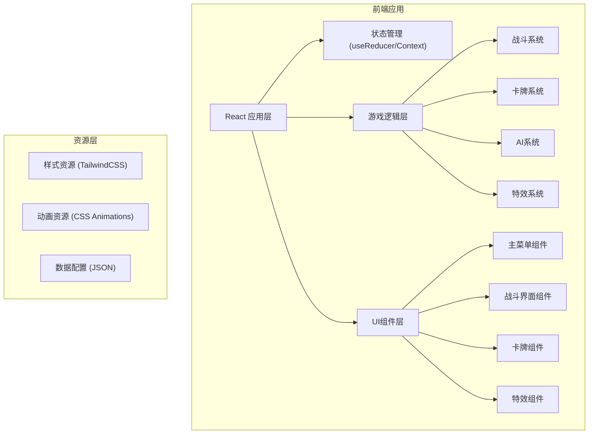

# 元素卡牌对战游戏 - 技术架构文档

## 1. 架构设计



## 2. 技术选型

- **前端框架**: React 18 + TypeScript
- **构建工具**: Vite
- **样式方案**: TailwindCSS 3
- **动画方案**: CSS Animations + Framer Motion
- **状态管理**: React useReducer + Context
- **字体**: Google Fonts (Cinzel Decorative, Lora)

## 3. 路由定义

| 路由 | 页面 | 描述 |
|-----|------|------|
| / | 主菜单 | 游戏入口，模式选择 |
| /battle/:mode | 战斗界面 | 核心游戏画面 |
| /result | 结算界面 | 胜负结算与奖励 |

## 4. 数据模型

### 4.1 卡牌数据模型

```typescript
type ElementType = 'fire' | 'water' | 'earth' | 'wind';

interface Card {
  id: string;
  element: ElementType;
  name: string;
  cost: number;
  damage?: number;
  heal?: number;
  armor?: number;
  draw?: number;
  description: string;
  rarity: 'common' | 'rare' | 'epic' | 'legendary';
}

interface ComboSkill {
  id: string;
  elements: [ElementType, ElementType];
  name: string;
  cost: number;
  damage?: number;
  heal?: number;
  armor?: number;
  draw?: number;
  stun?: number;
  burn?: number;
  freeze?: number;
  description: string;
  effectType: 'firestorm' | 'vinewrap' | 'steamburst' | 'sandstorm' | 'lavaeruption' | 'icestorm';
}
```

### 4.2 玩家数据模型

```typescript
interface Player {
  id: string;
  name: string;
  health: number;
  maxHealth: number;
  mana: number;
  maxMana: number;
  armor: number;
  hand: Card[];
  deck: Card[];
  graveyard: Card[];
  statuses: StatusEffect[];
}

interface StatusEffect {
  type: 'burn' | 'freeze' | 'stun' | 'armor_boost' | 'attack_debuff';
  duration: number;
  value: number;
}
```

### 4.3 游戏状态模型

```typescript
interface GameState {
  phase: 'menu' | 'battle' | 'result';
  mode: 'classic' | 'challenge' | 'endless' | 'quick';
  turn: number;
  currentPlayer: 'player' | 'enemy';
  player: Player;
  enemy: Player;
  selectedCards: string[];
  battleLog: BattleLogEntry[];
  winner: 'player' | 'enemy' | null;
  animations: AnimationState[];
}

interface BattleLogEntry {
  id: string;
  turn: number;
  actor: 'player' | 'enemy';
  action: string;
  value?: number;
}
```

## 5. 核心系统设计

### 5.1 战斗系统

- 回合制战斗，双方交替行动
- 每回合开始恢复法力值并抽一张牌
- 玩家可选择打出单卡或组合技能
- 伤害计算：基础伤害 + 加成 - 护甲
- 状态效果持续回合数递减

### 5.2 组合系统

- 选中两张不同元素的卡牌触发组合
- 组合技能消耗两张牌的法力值总和
- 组合效果强于两张牌单独效果之和
- 提供视觉反馈和特效动画

### 5.3 AI系统

- 简单AI：随机出牌
- 中级AI：优先使用组合技能
- 高级AI：根据血量和局势选择最优策略
- Boss AI：独特技能和行为模式

### 5.4 特效系统

- 纯CSS/SVG实现元素特效
- 卡牌入场、出牌、受击动画
- 组合技能全屏特效
- 伤害数字飘字动画
- 屏幕震动与颜色滤镜

## 6. 组件结构

```
src/
├── components/
│   ├── Card/           # 卡牌组件
│   ├── BattleField/    # 战场组件
│   ├── PlayerHUD/      # 玩家信息栏
│   ├── HandArea/       # 手牌区域
│   ├── MenuScreen/     # 主菜单
│   ├── BattleScreen/   # 战斗界面
│   ├── ResultScreen/   # 结算界面
│   └── Effects/        # 特效组件
├── hooks/
│   ├── useGameState.ts # 游戏状态管理
│   └── useBattleLogic.ts # 战斗逻辑
├── data/
│   ├── cards.ts        # 卡牌数据
│   ├── combos.ts       # 组合技能数据
│   └── enemies.ts      # 敌人数据
├── utils/
│   ├── battle.ts       # 战斗工具函数
│   └── animation.ts    # 动画工具
├── types/
│   └── index.ts        # 类型定义
└── App.tsx
```

## 7. 性能优化

- 使用 React.memo 优化卡牌组件渲染
- 动画使用 CSS transform 避免重排
- 特效使用 CSS 变量控制颜色和位置
- 状态更新批量处理减少重渲染
- 图片资源懒加载与预加载
